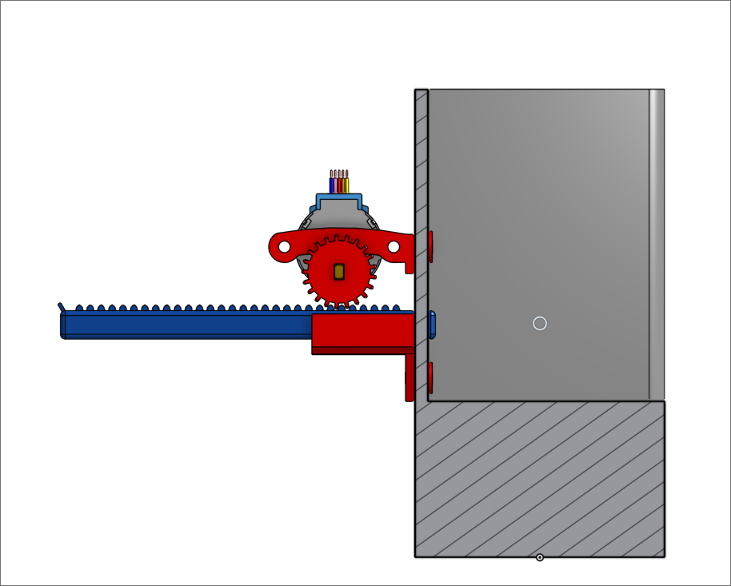
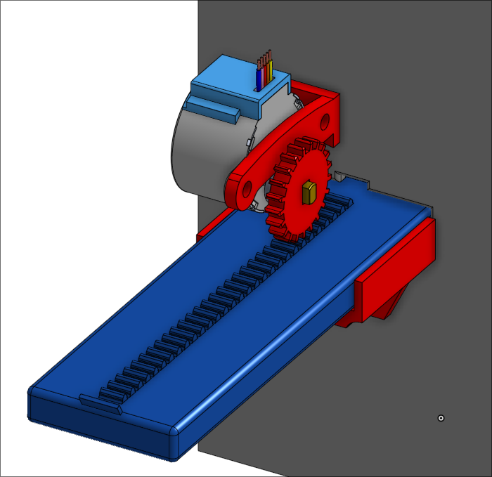
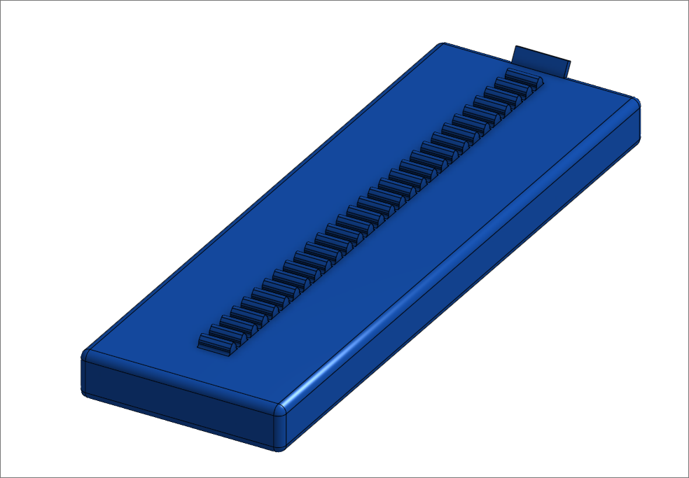
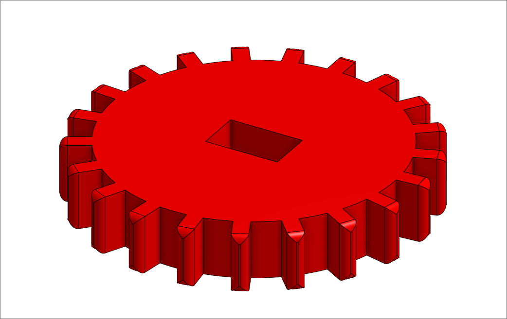
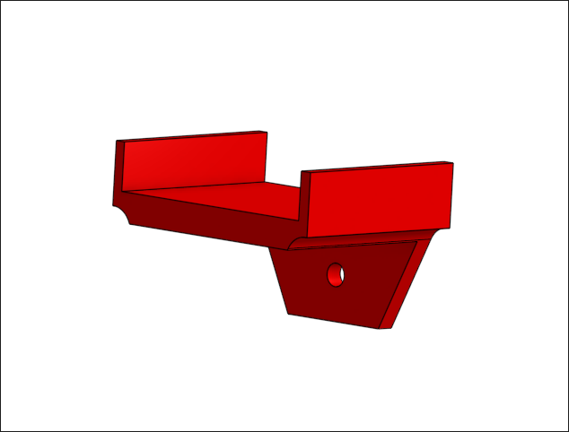

<div align="center">
    
</div>
<br>

---

<br>

Dieses Repository enthält den Sourcecode und die Dokumentation meiner Facharbeit zum Thema:  
***"Planung und Umsetzung eines Prototyps zur Automatisierung der Ein- und Auslagerung von Kartons in einer logistischen Anlage"***

## 📒 Materialliste

Für die Umsetzung des Prototyps werden folgende Materialien benötigt:

- *2x* **Arduino NANO**  
- *2x* **Schrittmotor (Stepper Motor)**  
- *2x* **Schrittmotortreiber (Stepper Motor Driver)**  
- *2x* **USB-C Kabel**  
- *3x* **M4 Schrauben, 14 mm**  
- *4x* **M4 Schrauben, 7 mm**

---

## 🛠️ Schritt 1: Design und Planung

Im ersten Schritt wurde eine grobe Skizze erstellt, um sich ein Bild von einem möglichen fertigen Prototypen zu machen.

> 
>
> *Grobe Skizze*

Nach der Skizze wurden die einzelnen Komponenten des Prototyps in einer detaillierten 3D-Zeichnung konstruiert. Dabei wurden auch Lösungsansätze wie ein Schiebemechanismus zur Ein- und Auslagerung in Lagerzellen konkretisiert.

Der Prototyp besteht aus drei Hauptkomponenten, die wiederum aus kleineren Einzelteilen bestehen:

- **Lagerzelle** *(Storage Cell)*  
    - Schieber *(Piston)*  
    - Schieberführung *(Piston Guide)*  
    - Motorhalterung *(Motor Mount)*  
    - Zahnrad *(Gear)*

- **Fördersystem** *(Conveyor Belt)*  
    - Gestell *(Base)*  
    - Rolle *(Roll)*  
    - Zahnrad *(Gear)*

---

## 🧱 Lagerzelle

Die Lagerzelle dient der Aufbewahrung von Boxen. Sie verfügt über einen Schiebemechanismus, mit dem Boxen aus der Lagerzone auf ein Förderband geschoben werden können.

> <p float="left">
> 
> 
> </p>
>
> *Lagerzelle in der 3D-Ansicht*

### ⚙️ Schieber & Zahnrad

Der Schieber ist ein ***9 mm x 39 mm x 120 mm*** großes Rechteck mit ***30 Zähnen*** (Ritzeln) auf der Oberseite.  
Er wird durch ein ***ø 20 mm*** Zahnrad mit **21 Zähnen** bewegt, was zu einem Übersetzungsverhältnis von ***1,42 : 1*** führt.

> <p float="left">
> 
> 
> </p>
>
> *Schieber und Zahnrad*

### Schieberführung

Die Schieberführung verhindert, dass sich der Schieber verkantet oder in der Öffnung blockiert.  
Zur Befestigung ist ein Loch für eine ***M4-Maschinenschraube*** vorhanden.

> 
>
> *Schieberführung*


## 🏗️ Aufbau & Mechanik

Die einzelnen Komponenten wurden mit 3D-gedruckten Teilen zusammengebaut. Die Lagerzelle ist fest mit dem Gehäuse verbunden, während das Förderband mittig durchläuft.  
Ein Zahnrad übersetzt die Drehbewegung des Motors auf den Schiebermechanismus. Der Fördermechanismus kann Boxen in beide Richtungen transportieren.

---

## 🔌 Steuerung

Die Steuerung erfolgt über zwei Arduino Nanos. Einer ist für das Verschieben der Boxen aus den Lagerzellen zuständig, der andere für das Förderband.

Die Motoren werden über Stepper-Motor-Treiber angesteuert. Die Kommunikation zwischen den Modulen erfolgt über einfache serielle Signale (UART).

> **Beispiel-Signalfluss:**
> Host-PC → Arduino 1 → Schrittmotor (Lagerzelle) ↓ Arduino 2 → Schrittmotor (Förderband)

---

## 🚀 Funktionsweise

Der Ablauf beim Auslagern einer Box läuft wie folgt ab:

1. Ein Befehl vom Steuer-PC löst den Vorgang aus.
2. Die Lagerzelle schiebt die Box auf das Förderband.
3. Das Förderband transportiert die Box zur Entnahmestelle.

Analog funktioniert auch das Einlagern:  
Die Box wird über das Förderband zur Lagerzelle gebracht und durch den Schieber hineingeschoben.

---

## 📈 Ausblick

In Zukunft wäre eine Erweiterung mit Sensoren zur Positionsbestimmung denkbar. Auch die Anbindung an ein zentrales Logistiksystem oder eine Weboberfläche zur Steuerung ist geplant.

---

## 📁 Verzeichnisstruktur

```plaintext
├── code/               # Arduino-Code für Steuerung
├── img/                # Skizzen, Renderings, Diagramme
├── models/             # 3D-Modelle (STL/STEP-Dateien)
├── docs/               # Facharbeit & Dokumentation
└── README.md
```