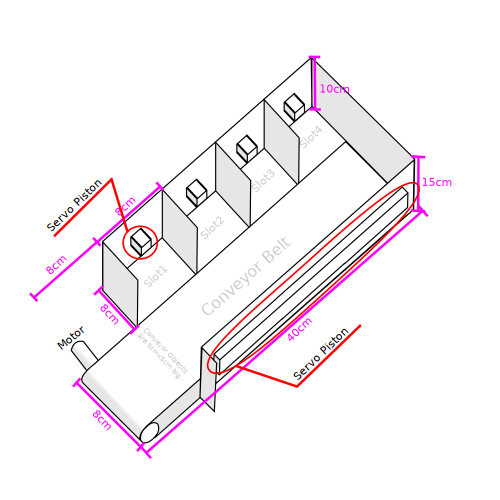

    
     
     
    <h1>Automatisches Lager</h1>

Dieses Repository enthält den Sourcecode und die Dokumentation meiner Facharbeit zum Tehma: ***"Planung und Umsetzung eines Prototyps zur Automatisierung der Ein- und Auslagerung von Kartons in einer logistischen Anlage"***.

## 📒 Material Liste
Zur umsetzung des Prototyps werden folgende materialien Benötigt:
- *1x* **ESP32**
- *1x* **RPI 4**
- *6x* **Servo Motor**
- *1x* **Stepper Motor**

## 📏 Sketch
